# Aequus Tech — Flujos, procesos y reglas del negocio

**Documento de validación para Andrés Cháves Paz (PO)** · 9-sep-2026 · Jefferson Arcos

**Qué es esto:** todo lo que entendí de las entrevistas E01, E02 y E03, organizado como el negocio va a funcionar en la plataforma. Nada de esto es técnico: es tu operación escrita en papel.

**Cómo responderlo:** lee y responde el **checklist de la sección 8** (al final) con **Sí / No / Se corrige así: …**. Si algo está mal en cualquier sección, márcalo y lo ajustamos el viernes 11-sep en la reunión.

**Convenciones:** ✅ = ya lo confirmaste en entrevistas · 🟡 = propuesta mía por confirmar · 🔴 = falta tu respuesta.

---

## 1. Roles: quién es quién en la plataforma

| Rol | Quién es | Qué hace | Qué NO hace | Canal |
| :---- | :---- | :---- | :---- | :---- |
| **Doliente / Afiliado titular** | Persona natural con plan (o sin plan, en urgencia) | Se afilia, registra beneficiarios, descarga contrato y carnet, solicita servicio, paga (urgencia), hace seguimiento, califica | No modifica beneficiarios fuera de ventana; no ve datos de otros | Web móvil + agente (chat y WhatsApp) |
| **Beneficiario** | Familiar registrado por el titular | Es validado como cubierto al momento del servicio | No ingresa al sistema en fase 1 (acceso familiar por definir) | — |
| **Administrador corporativo** | RRHH / fondo de empleados / cooperativa | Consulta afiliados y antigüedad, carga bases (Excel/CSV), reporta ingresos y retiros antes del día 28, valida facturas, ve tablero (protegidos, servicios del mes, siniestralidad, pagado vs usado), reportes de impacto social | **No edita fichas de afiliados** (cada afiliado llena la suya); no ve otras empresas | Web escritorio |
| **Proveedor funeraria** | Usuario de la funeraria (dueño o asistente de protocolo) | Recibe órdenes con alertas, acepta/rechaza, gestiona disponibilidad (salas, cofres, vehículos), publica su oferta, actualiza el checklist del servicio, ve su liquidación, pide servicios B2B a otra funeraria | No ve la comisión de otros; no edita la orden del cliente | Web + WhatsApp/correo |
| **Proveedor cementerio** | Cementerio de la red | Igual que funeraria, con catálogo de destino final (lotes, bóvedas, cenizarios, columbarios, mausoleos). **Entrada progresiva** (ver regla de cementerios) | — | Web + WhatsApp/correo |
| **Operador Aequus** | Tú (Andrés) | Curas la red (verificas y apruebas proveedores), fijas la comisión por convenio, gestionas convenios y tarifas, atiendes los casos que el agente te pasa, haces seguimiento a cotizaciones caídas (anti-salto), gestionas reclamos | No editas datos de afiliados (solo excepciones documentadas) | Consola interna |
| **Admin Aequus** | Jefferson | Configuración técnica, llaves, monitoreo, métricas del agente, soporte | No toca reglas de negocio sin ti | Consola interna |
| **Agente IA** | El agente de la plataforma | Identifica qué necesita el usuario, responde preguntas de cobertura, guía la afiliación y la solicitud de servicio, coordina alertas, atiende fuera de horario, **detecta luto agudo y pasa a humano de inmediato** | No ejecuta nada que tú no le hayas delegado; no promete precios finales ni excepciones; nunca atiende solo un momento sensible | Chat web + WhatsApp |
| **Asesor de protocolo** | Humano de la funeraria | Contacta al doliente 10–45 min después del reporte, orienta, actualiza el checklist | — | Teléfono + consola del proveedor |

### Quién puede hacer qué (vista rápida)

| Capacidad | Doliente | Corp. admin | Proveedor | Operador (tú) | Agente IA |
| :---- | :-: | :-: | :-: | :-: | :-: |
| Afiliarse / gestionar beneficiarios | ✅ | ❌ (carga masiva y novedades) | ❌ | excepciones | guía |
| Solicitar servicio / urgencia | ✅ | ✅ (a nombre de un afiliado) | ❌ | ✅ | guía + pasa a humano |
| Cotizar / comparar | ✅ | ✅ | ❌ | ✅ | apoya |
| Recibir y aceptar órdenes | ❌ | ❌ | ✅ | ✅ (documentado) | alerta |
| Actualizar checklist del servicio | ❌ | ❌ | ✅ | ✅ | notifica |
| Ver liquidación propia | ❌ | ✅ (facturas del convenio) | ✅ | ✅ (todas) | ❌ |
| Curaduría de red / comisiones | ❌ | ❌ | ❌ | ✅ | ❌ |
| Atender casos pasados a humano | ❌ | ❌ | ❌ | ✅ | los origina |

---

## 2. Los 10 procesos del negocio

| # | Proceso | Quién lo mueve |
| :---- | :---- | :---- |
| P1 | Venta y convenio corporativo (negociación → contrato previsora↔empresa → configuración del convenio en la plataforma) | Operador (tú) |
| P2 | Afiliación masiva corporativa (carga → links → cada afiliado llena su ficha → bloqueo) | El afiliado (autogestión) |
| P3 | Novedades mensuales y facturación del convenio (corte día 28 → prefactura → factura de la previsora → validación de la empresa → recaudo → dispersión) | Operador + previsora |
| P4 | Siniestro de afiliado (PLAN) | Funeraria (servicio) / plataforma (coordinación) |
| P5 | Urgencia / necesidad inmediata (y prepagado) | Plataforma + funeraria |
| P6 | B2B entre funerarias | Funerarias (la plataforma intermedia) |
| P7 | Liquidación y split billing | Plataforma |
| P8 | Curaduría de la red (onboarding → verificación → publicación de oferta) | Operador (tú) |
| P9 | Guardrail y paso a humano | Agente → Operador |
| P10 | Post-servicio (cierre, calificación, reportes, impacto social) | Plataforma |

---

## 3. Los flujos, paso a paso

### F0 — Curaduría: cómo entra un proveedor a la red

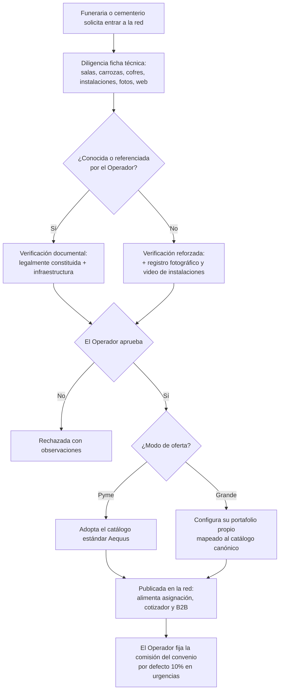

### F1 — Afiliación corporativa masiva (el caso Parco)

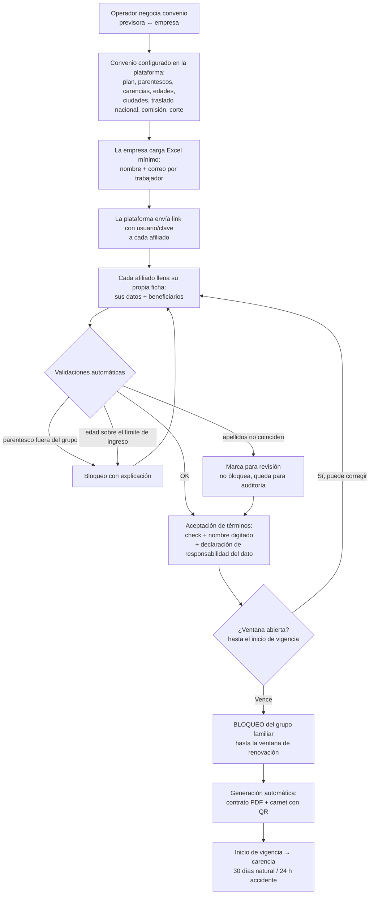

### F2 — Novedades y facturación mensual del convenio

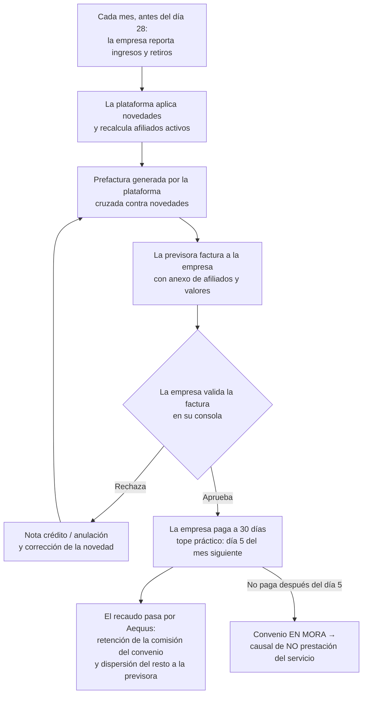

*(Hoy tú haces ese cruce de prefactura a mano para que coincida con lo que factura Jardines de Paz — la plataforma lo automatiza y exige que las cifras cuadren.)*

### F3 — Siniestro de un afiliado (PLAN) — el flujo central

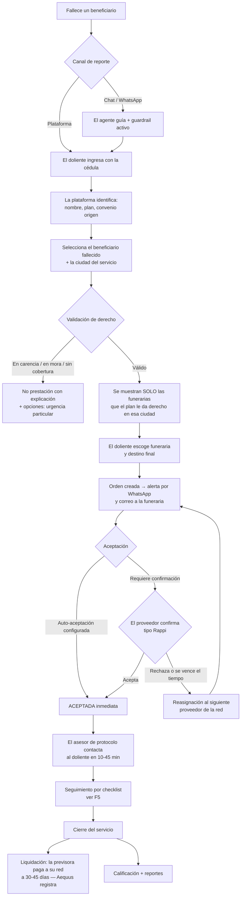

### F4 — Urgencia / necesidad inmediata

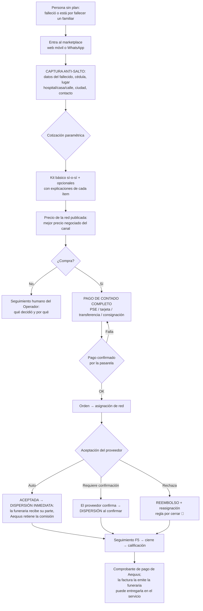

### F5 — Seguimiento del servicio (el checklist de la funeraria)

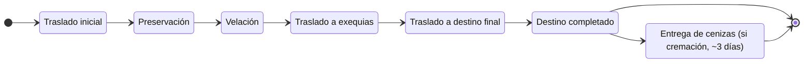

La funeraria actualiza cada paso; el doliente lo ve en tiempo real desde su celular (estilo "link del concesionario", sin fotos de preservación). Este checklist es además **la herramienta de gestión que la funeraria no tiene hoy** (Excel/papel) — ese es el gancho para que la usen.

### F6 — B2B entre funerarias

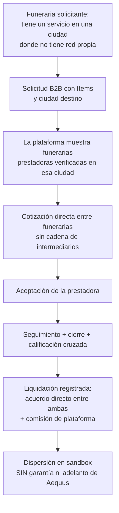

### F7 — Guardrail de luto agudo y paso a humano

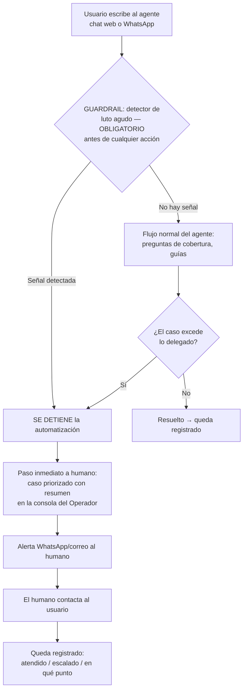

Ante la duda, el agente transfiere: preferimos mil falsos positivos a dejar solo a una persona en luto agudo.

### F8 — Cotizador

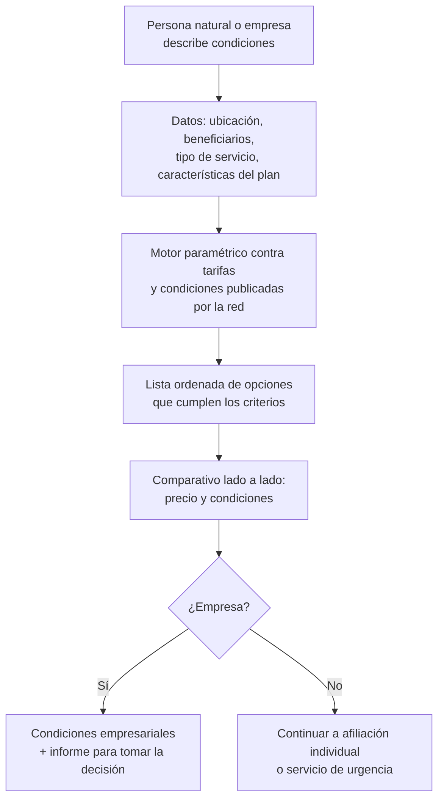

### F9 — Upgrade de plan y renovación

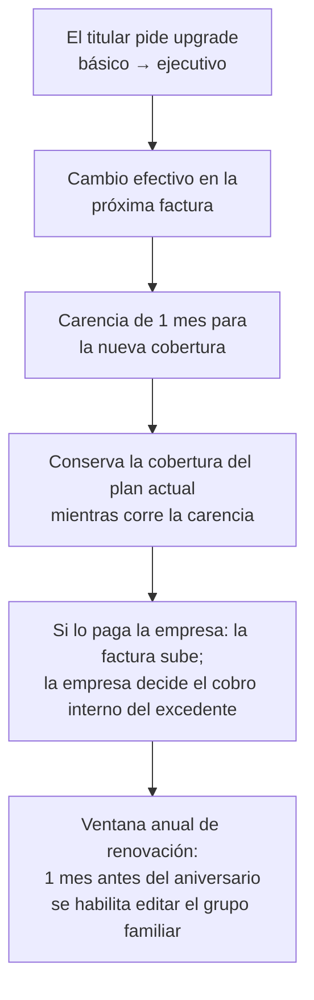

### F10 — Muerte del titular → continuidad del plan

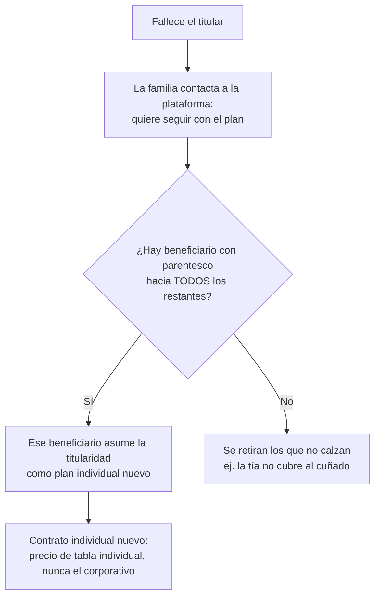

---

## 4. Los estados de cada cosa (ciclo de vida)

### 4.1 La orden de servicio (el eje de todo)

**Ruta principal (camino feliz):**

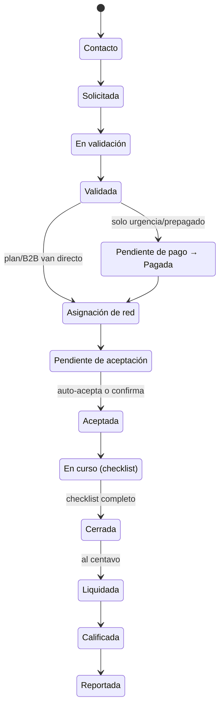

**Salidas y excepciones (todas quedan registradas):**

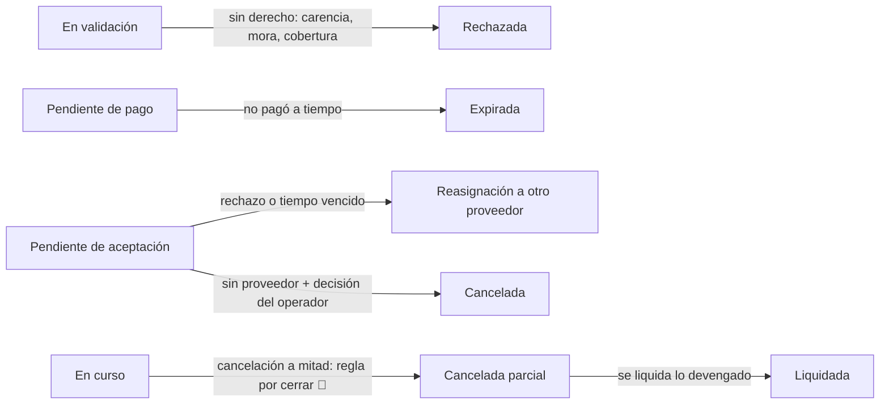

**Las 4 variantes usan la misma ruta:**
- **PLAN:** entra con afiliación previa; no pasa por pago (la previsora paga a su red a 30–45 días; Aequus registra).
- **URGENCIA:** exige pago confirmado antes de asignar.
- **PREPAGADO:** como PLAN en pago (ya está pago), con validación de vigencia del prepago 🔴.
- **B2B:** quien pide es una funeraria; la liquidación registra el acuerdo directo + la comisión de plataforma.

### 4.2 El afiliado

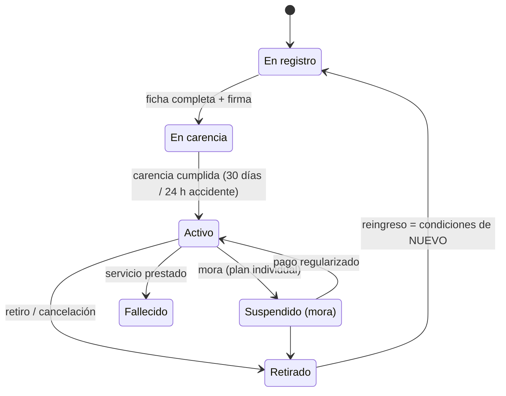

### 4.3 El convenio corporativo

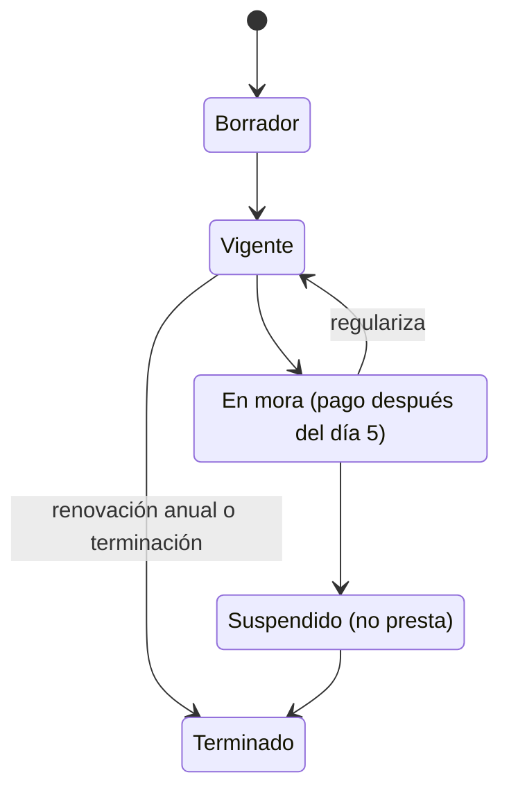

### 4.4 La liquidación

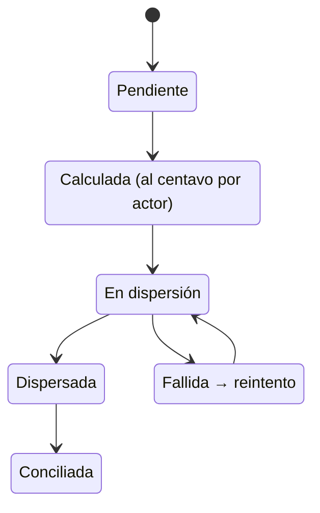

---

## 5. Anti-salto: cómo se protege el canal

Tu miedo #1: el usuario cotiza y se va directo a la funeraria. El diseño acordado:

1. ✅ **Captura primero:** datos del fallecido y del contacto **antes** de mostrar precios.
2. ✅ **Reglas de juego contractuales** con el proveedor: mejor precio al canal Aequus; prohibido sobreprecio al cliente referido.
3. ✅ **Descuentos exclusivos** que solo aplican dentro de la plataforma.
4. ✅ **Evidencia de origen:** toda cotización queda registrada con el fallecido identificado → soporte para cobrar la comisión si el servicio se presta por fuera.
5. ✅ **Seguimiento humano** del Operador a cotizaciones caídas ("¿qué determinación tomó?").
6. 🟡 **El usuario sí ve y escoge la funeraria** (rechazaste ocultarla — la confianza es la palanca principal: "que prefieran hacerlo con nosotros").

---

## 6. Reglas de negocio (salen de tus entrevistas)

### Afiliación y planes

| # | Regla | Estado | Origen |
| :---- | :---- | :-: | :-: |
| 1 | Grupo familiar por estado civil: soltero → hijos, padres, hermanos; casado → cónyuge, hijos, padres **o** suegros. Configurable por convenio (titular+7, +9, +14…) | ✅ | E02 |
| 2 | Edad máxima de **ingreso** configurable por convenio (ideal: titular 62, padres 75, hijos 30; realidad de mercado: sin límite). Permanencia: sin límite | ✅ | E02 |
| 3 | Carencias configurables: corporativo típico 30 días muerte natural/enfermedad (incl. terminal); accidente 24 h. **Sin excepciones** | ✅ | E02 |
| 4 | Grupo familiar **inmodificable** desde el día 1 de vigencia hasta la ventana de renovación (1 mes antes del aniversario) | ✅ | E02 |
| 5 | Upgrade de plan en cualquier momento; efectivo en la próxima factura; carencia de 1 mes para la nueva cobertura; conserva la actual mientras tanto | ✅ | E02 |
| 6 | Sin fotocopias ni certificados de matrimonio; el titular es responsable del dato (declaración junto a la firma); nombre como aparece en la cédula | ✅ | E02 |
| 7 | Validación automática: parentesco permitido + edad calculada de la fecha de nacimiento + revisión de apellidos (marca para auditoría, no bloquea sola) | ✅ | E02 |
| 8 | Duplicidad permitida (N planes, incluso de distintas previsoras). Al fallecer se usa **uno**; elige la familia; la plataforma sugiere el de mejores condiciones | ✅ | E02 |
| 9 | Muere el titular: continúa quien tenga parentesco con **todos** los restantes, como plan individual nuevo (precio individual, nunca el corporativo) | ✅ | E02 |
| 10 | Sale de la empresa → puede saltar a individual con filtro de antigüedad del convenio (ej. Jardines ~4 años para grupos con edades altas) | ✅ | E02 |
| 11 | Reingreso tras retiro/mora = condiciones de afiliado **nuevo** | ✅ | E02 |
| 12 | Recién nacido / nuevo cónyuge a mitad de año: ¿desde cuándo cubre? | 🔴 | pendiente |
| 13 | Coberturas con topes en salarios mínimos (bóveda, osario) vs incluido/no incluido | 🔴 | pendiente |
| 14 | Enfermedades que excluyen o encarecen; quién autoriza la excepción | 🔴 | pendiente |
| 15 | Si la previsora cambia el precio mañana, ¿los afiliados actuales conservan el viejo? | 🔴 | pendiente |

### Facturación y mora

| # | Regla | Estado | Origen |
| :---- | :---- | :-: | :-: |
| 16 | Corporativo: factura mensual a la empresa (nunca al titular) con anexo de afiliados; pago a 30 días; después del día 5 del mes siguiente = convenio en mora = **no prestación** | ✅ | E02 |
| 17 | Tres modalidades de pago del plan corporativo: paga empresa / descuento de nómina / subsidio mixto | ✅ | E02 |
| 18 | Corte de novedades día 28; la prefactura cruzada debe coincidir con la factura de la previsora | ✅ | E02/E03 |
| 19 | Individual: renovación anual pagada **antes** del aniversario; mora → cancelación automática | ✅ | E02 |
| 20 | Siniestro en mora = no se presta, **salvo** soporte de pago con fecha anterior a la muerte | ✅ | E02 |
| 21 | Estrategia de cobro al corporativo moroso (la "otra estrategia" que mencionaste) | 🔴 | pendiente |

### Urgencias

| # | Regla | Estado | Origen |
| :---- | :---- | :-: | :-: |
| 22 | Pago de contado, completo, **antes** del servicio | ✅ | E01 |
| 23 | Kit básico sí-o-sí: traslado inicial, preservación, cofre línea básica, arreglo floral, carroza, cinta membretada, trámites/licencias, exequias, velación 24 h. La velación se puede quitar a petición | ✅ | E01 |
| 24 | El precio lo mueven: tier de funeraria, cofre escogido, adicionales, destino final | ✅ | E01 |
| 25 | Muerte por accidente/violenta → medicina legal → **no cremación** (se bloquea en el cotizador) | ✅ | E01/E03 |
| 26 | Certificado de defunción según el lugar: hospital (médico tratante) / casa con enfermedad terminal (EPS) / casa sin EPS (policía + EPS o forense de turno) / accidente (medicina legal) | ✅ | E03 |
| 27 | Nadie mueve el cuerpo sin certificado de defunción; licencias de cremación/inhumación para el destino | ✅ | E01 |
| 28 | SLA de llegada de la carroza (¿cuánto tiempo se promete?) | 🔴 | pendiente |
| 29 | Prepagado: qué se prepaga, congelamiento de precio, vigencia, si muere en otra ciudad | 🔴 | pendiente |

### Red y asignación

| # | Regla | Estado | Origen |
| :---- | :---- | :-: | :-: |
| 30 | Proveedor: legalmente constituido + infraestructura (salas, carroza mínimo); verificación con fotos/video si es desconocido; auditoría del Operador | ✅ | E02 |
| 31 | Intermediarios fuera del modelo: convenio directo con quien presta | ✅ | E02 |
| 32 | Oferta en dos modos: catálogo estándar Aequus (pymes) o portafolio propio (grandes), ambos mapeados al catálogo canónico con alias por proveedor | ✅ | E01 |
| 33 | Tier por posición de marca (básica/media/alta), no por tamaño | ✅ | E01/E02 |
| 34 | Aceptación configurable por proveedor: auto-aceptación o confirmación manual (tipo Rappi); si se vence el tiempo → reasignación | ✅ | E03 |
| 35 | Dos funerarias en la misma ciudad: ¿quién decide, tú o una regla automática? | 🔴 | pendiente |
| 36 | Cementerios como actores con dispersión propia: módulo **progresivo y enchufable**; al inicio la funeraria coordina el cementerio como hoy. Falta tu decisión final | 🔴 | pendiente |
| 37 | Ciudad sin cobertura (foráneo): ¿qué se le ofrece a la familia? | 🔴 | pendiente |
| 38 | Traslado nacional: no todos los planes lo incluyen; estándar = traslado al lugar de residencia habitual; otra ciudad = lo paga la familia | ✅ | E03 |

### Dinero

| # | Regla | Estado | Origen |
| :---- | :---- | :-: | :-: |
| 39 | Urgencias: comisión Aequus por defecto **10%** (rango 5–10%), negociable por funeraria; la fija el Operador por convenio | ✅ | E03 |
| 40 | Planes: comisión por convenio — corporativo 18–20%, individual 18–25% — definida con cada previsora | ✅ | E03 |
| 41 | Aequus **no factura** el servicio ni los planes; entrega comprobante de pago (patrón Mercado Libre); factura la funeraria/previsora | ✅ | E03 |
| 42 | Dispersión: inmediata si el proveedor auto-acepta; al confirmar si requiere confirmación | ✅ | E03 |
| 43 | Servicios exequiales exentos de IVA | ✅ | E03 |
| 44 | Rechazo tras el pago / cancelación a mitad: política de reembolso y qué se cobra | 🔴 | pendiente |
| 45 | El fee de la pasarela (1.3–3.3% + fijo según medio): ¿lo asume Aequus o se negocia con el funerario? | 🔴 | pendiente |
| 46 | Tratamiento contable de las cuotas (¿anticipo?) y facturación de la comisión de Aequus (pregunta con tu contadora) | 🔴 | pendiente |
| 47 | Pasarela definitiva (Wompi / ePayco / Bold) + apertura de cuenta y llaves | 🔴 | pendiente |

### Servicio y seguimiento

| # | Regla | Estado | Origen |
| :---- | :---- | :-: | :-: |
| 48 | Derecho al servicio = afiliado activo + carencia cumplida + sin mora + beneficiario registrado + cobertura en la ciudad | ✅ | E02 |
| 49 | Validaciones al reportar < 10 min; contacto humano 10–45 min | ✅ | E03 |
| 50 | Velación 24 h desde la recogida; recogida ~18:00 → velación al día siguiente | ✅ | E01 |
| 51 | La funeraria actualiza el checklist; es su herramienta de gestión (valor a cambio del dato) | ✅ | E03 |
| 52 | El doliente ve el avance en tiempo real; sin fotos de preservación | ✅ | E03 |
| 53 | Reclamo en curso = corrección en el momento; queja al final = calificación | ✅ | E03 |
| 54 | Confirmación de cumplimiento: checklist completo + (¿firma de conformidad de la familia?) | 🟡 | E03 |
| 55 | Matriz de notificaciones: qué evento va por WhatsApp y cuál por correo; ¿toda la familia ve el servicio o un solo usuario? | 🔴 | pendiente |
| 56 | Cancelación a mitad de servicio: qué se cobra (lo devengado por checklist) y qué se devuelve | 🔴 | pendiente |

### B2B entre funerarias

| # | Regla | Estado | Origen |
| :---- | :---- | :-: | :-: |
| 57 | Solicitud → cotización → asignación directa → aceptación → seguimiento → cierre → calificación → liquidación registrada | ✅ | Plan |
| 58 | Sin garantía ni adelanto de pago de Aequus a la prestadora | ✅ | Plan |
| 59 | Comisión de plataforma sobre el acuerdo directo | ✅ | Plan |
| 60 | ¿Marca blanca o se revela la funeraria prestadora? | 🔴 | pendiente |
| 61 | Demandantes institucionales (aseguradora/fondo que autogestiona): reglas por definir | 🟡 | Plan |

### El agente IA y el guardrail

| # | Regla | Estado | Origen |
| :---- | :---- | :-: | :-: |
| 62 | El agente solo ejecuta tareas que tú le delegues explícitamente (lista firmada por ti) | ✅ | Plan |
| 63 | Guardrail de luto agudo: detiene la automatización y pasa a humano con resumen; ante la duda, transfiere | ✅ | Plan |
| 64 | Transparencia: el usuario siempre sabe que habla con una IA | ✅ | Plan |
| 65 | El agente guía hasta la dispersión a la funeraria; de ahí en adelante es humano | ✅ | E03 |
| 66 | Métricas del agente visibles para ti: atendidos / resueltos / escalados / en qué punto escaló | ✅ | Plan |
| 67 | Tareas delegadas fase 1: consulta de vigencia/cobertura, comparación de planes propios, guía de solicitud, coordinación de alertas, atención fuera de horario | ✅ | Plan |
| 68 | Momento exacto IA→humano, frases típicas del doliente, lo que la IA no dice jamás | 🔴 | pendiente |

---

## 7. Lo que queda configurable por convenio (sin programar nada)

Estas decisiones cambian por convenio o proveedor y la plataforma las trata como **configuración**, nunca quemadas:

- Parentescos permitidos, límites de edad, carencias, ciudades de cobertura, traslado nacional → por convenio/plan.
- Comisión por convenio y por motor (por defecto 10% en urgencias).
- Auto-aceptación vs confirmación manual → por proveedor.
- Catálogo estándar vs portafolio propio → por proveedor.
- Cementerio con dispersión propia vs gestionado por la funeraria → por orden/convenio.
- Medios de pago habilitados (PSE, tarjeta, transferencia, consignación).

---

## 8. Checklist de validación (respóndelo punto por punto)

**Instrucción:** responde cada punto con **Sí / No / Se corrige así: …**. Los 🔴 no bloquean la firma si quedan con fecha de respuesta acordada (a más tardar E04).

1. Los 9 roles de la sección 1 son los correctos y nadie falta (en especial: ¿el beneficiario sin login está bien para fase 1? ¿el Operador eres tú con esos poderes?).
2. F1 (afiliación masiva) refleja Parco y tu operación actual: Excel → links → cada afiliado llena su ficha → bloqueo → ventana de renovación.
3. F2 (novedades y facturación): corte día 28, prefactura cruzada, factura de la previsora a la empresa, mora después del día 5.
4. F3 (siniestro PLAN): validación → solo funerarias del plan → aceptación → protocolo 10–45 min → seguimiento → cierre.
5. F4 (urgencia): captura anti-salto antes de cotizar, kit sí-o-sí, pago contado antes del servicio, dispersión inmediata o tras confirmación.
6. F5 (seguimiento): los 6–7 pasos del checklist son los correctos y en ese orden.
7. F6 (B2B): sin garantía ni adelanto; comisión de plataforma sobre el acuerdo directo.
8. F7 (guardrail): el agente se detiene ante luto agudo y pasa a humano con resumen; tú atiendes la consola.
9. Reglas ✅ de la sección 6: confirmo que están bien transcritas (especialmente 1–11, 16–20, 22–27, 39–43).
10. Reglas 🔴: me comprometo a responderlas con fecha acordada (a más tardar en E04).
11. Comisiones: 10% por defecto urgencias (5–10%), 18–20% corporativo, 18–25% individual, por convenio. ¿Confirmado?
12. Aequus no factura; comprobante de pago + factura de la funeraria/previsora. ¿Confirmado con tu contadora? (regla 46)
13. Cementerios: ¿arrancamos con la funeraria coordinando el cementerio y el módulo de cementerio enchufable después? (regla 36)
14. Pasarela: ¿cuál (Wompi/ePayco/Bold) y cuándo abres la cuenta y pides las llaves? (regla 47)

**Firma de validación v1.0 (en la reunión del viernes 11-sep):** Andrés Cháves Paz — fecha: ______________
